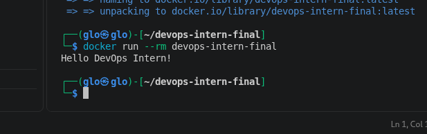

# devops-intern-final
# DevOps Intern Final Assessment

Author:Gloria Kiarie
Date:2026-08-28

## Project Description
This repository documents a small end-to-end DevOps pipeline built as part of
a DevOps Internship final assessment - covering Git/GitHub, Linux scripting,
Docker, CI/CD (GitHub Actions), job orchestration (Nomad), and log monitoring
(Grafana Loki).

## Steps
- [x] 1. Git & GitHub Setup
- [x] 2. Linux & Scripting Basics
- [x] 3. Docker Basics
- [ ] 4. CI/CD with GitHub Actions
- [ ] 5. Job Deployment with Nomad
- [ ] 6. Monitoring with Grafana Loki

## Step 1: Git & GitHub Setup
Repository initialized with this README and a sample `hello.py` script that
prints `Hello, DevOps!`.

Run it locally:
'''bash
python3 hello.py
'''

## Step 2: Linux & Scripting Basics
`scripts/sysinfo.sh` is a shell script that prints:
- Current user (`whoami`)
- Current date (`date`)
- Disk usage (`df -h`)

Run it:
```bash
chmod 755 scripts/sysinfo.sh
./scripts/sysinfo.sh
```
## Step 3: Docker Basics
A `Dockerfile` containerizes `hello.py`. The container runs `python hello.py`
on startup.

Build the image:
```bash
docker build -t devops-intern-final .
```

Run the container:
```bash
docker run --rm devops-intern-final
```

Expected output:



```
Hello, DevOps!
```
## Step 4: CI/CD with GitHub Actions
[](https://github.com/glo-g/devops-intern-final/actions/workflows/ci.yml)